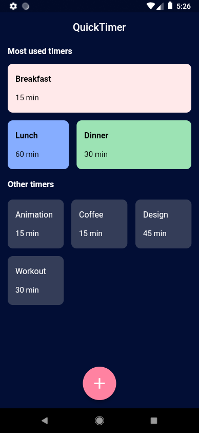
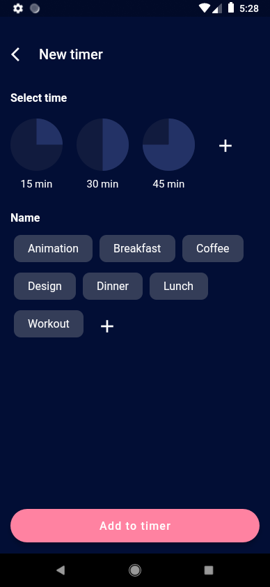
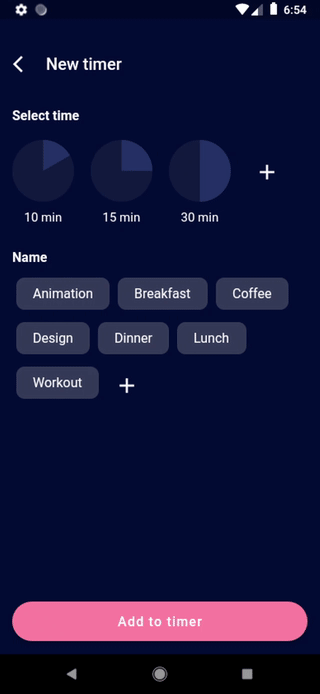

<a href="https://github.com/gzaber/quick_timer/actions"></a>
<a href="https://codecov.io/gh/gzaber/quick_timer"></a>
<a href="https://opensource.org/licenses/MIT"></a>

# quick_timer

A simple timer app based on the following concept:  
https://dribbble.com/shots/6623316-Quick-Timer

## Table of contents

- [Screenshots](#screenshots)
- [Features](#features)
- [Packages used](#packages-used)
- [Setup](#setup)
- [Test](#test)
- [Run](#run)

## Screenshots

[](.screenshots/timers_overview_page.png)
&nbsp;
[](.screenshots/new_timer_page.png)

[](.screenshots/recording1.gif)
&nbsp;
[](.screenshots/recording2.gif)

## Features

- run timer
- play sound when timer completed
- create / delete timer
- create / delete interval in minutes
- create / delete name
- supported locales: en, pl

## Packages used

- audioplayers
- bloc
- equatable
- get_it
- hive
- json_annotation
- uuid

## Setup

Clone or download this repository.  
Use the following command to install all the dependencies:

```
$ flutter pub get
```

## Test

Run the tests using your IDE or using the following command:

```
$ flutter test --coverage
```

For local Flutter packages run above command in package root directory.  
For local Dart packages run the following commands in package root directory:

```
$ dart pub global activate coverage
$ dart pub global run coverage:test_with_coverage
```

## Run

Run the application using your IDE or using the following command:

```
$ flutter run
```
